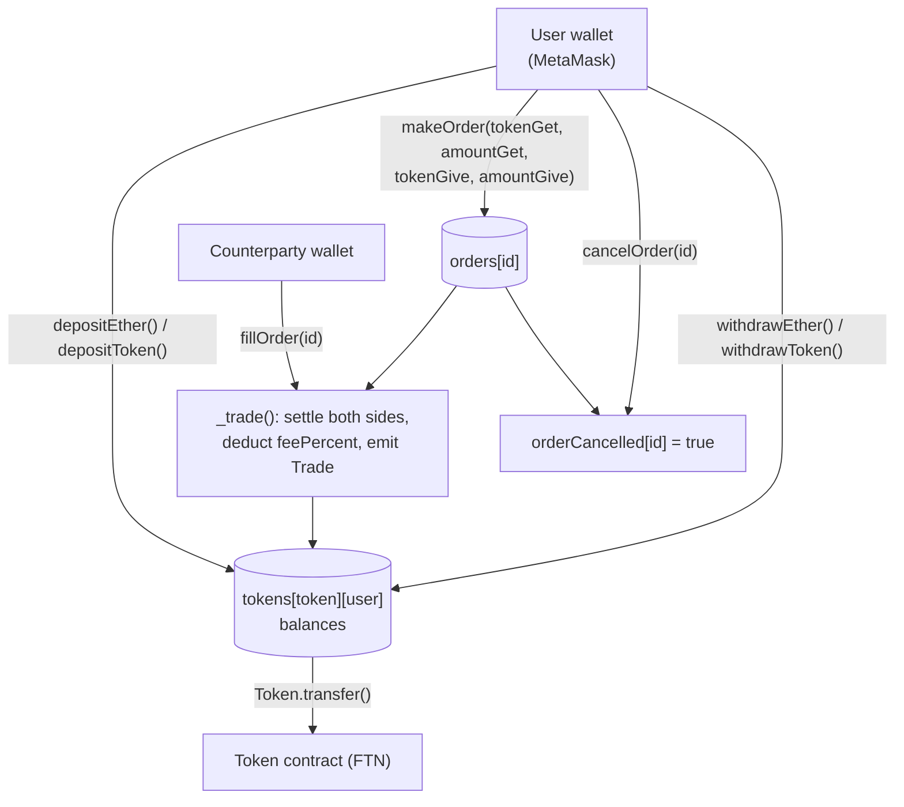

# ERC20 Token - Fortune Token (FTN)

## Description

This application builds and deploys an ERC20 token in compliance with EIP standards, along with an exchange for trading it. It uses two Solidity smart contracts — one for the token, one for the exchange — with a React front end using Redux for global state management.

## Table of Contents

- [How It Works](#how-it-works)
- [Installation](#installation)
- [Usage](#usage)
- [Technologies](#technologies)
- [License](#license)
- [Tests](#tests)
- [Next Steps](#next-steps)
- [About the Creator](#about-the-creator)

## How It Works

The `Exchange` contract (`src/contracts/Exchange.sol`) holds user balances directly — depositing credits an internal `tokens[token][user]` mapping rather than moving funds on every trade, so orders settle with a single internal transfer instead of two on-chain approvals per trade:



The settlement itself — the part that actually moves balances and takes a fee — is one function:

```solidity
function _trade(uint256 _orderId, address _user, address _tokenGet, uint256 _amountGet, address _tokenGive, uint256 _amountGive) internal {
    // Fee paid by the user that fills the order, a.k.a. msg.sender.
    uint256 _feeAmount = _amountGet.mul(feePercent).div(100);

    tokens[_tokenGet][msg.sender] = tokens[_tokenGet][msg.sender].sub(_amountGet.add(_feeAmount));
    tokens[_tokenGet][_user] = tokens[_tokenGet][_user].add(_amountGet);
    tokens[_tokenGet][feeAccount] = tokens[_tokenGet][feeAccount].add(_feeAmount);
    tokens[_tokenGive][_user] = tokens[_tokenGive][_user].sub(_amountGive);
    tokens[_tokenGive][msg.sender] = tokens[_tokenGive][msg.sender].add(_amountGive);

    emit Trade(_orderId, _user, _tokenGet, _amountGet, _tokenGive, _amountGive, msg.sender, now);
}
```

## Installation

```
npm install
```

Compile and migrate the smart contracts to a local blockchain (e.g. Ganache):

```
truffle compile
truffle migrate
```

## Usage

Start the React app:

```
npm start
```

Connect a Web3 wallet (e.g. MetaMask) to interact with the deployed Token and Exchange contracts.

## Technologies

- React.js
- JavaScript
- Node.js
- Solidity
- Truffle (Mocha and Chai testing frameworks built in)
- NPM

## License

[MIT](https://opensource.org/licenses/MIT)


## Tests

Tests are created for each smart contract in the application:

```
truffle test
```

- `Token.test.js`
- `Exchange.test.js`

## Next Steps

No further work planned at this time.

## About the Creator

Built to explore ERC20 token standards and decentralized exchange mechanics with Solidity and Truffle.

- LinkedIn: https://www.linkedin.com/in/jayme-hall/
- GitHub: https://github.com/jaymehall/
- Website: [https://jaymehall-dev.netlify.app/](https://jaymehall-dev.netlify.app/)
